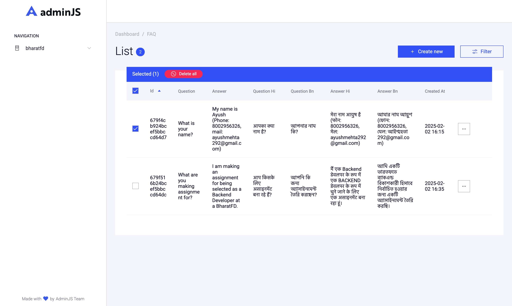

# Node.js FAQ API with Docker, MongoDB & Redis

  

---

## 🚀 Overview
This project is a Node.js web application that provides a robust **REST API** for managing FAQs with multilingual support, automatic translations, caching via **Redis**, and an intuitive admin interface using **AdminJS**. It is fully containerized using **Docker** for seamless deployment.

---

## 📂 Project Structure
```
faq-project/
├── Dockerfile                
├── docker-compose.yml        
├── package.json             
├── README.md                 
├── src
│   ├── app.js               
│   ├── config
│   │   └── db.js             
│   ├── controllers
│   │   └── faqController.js  
│   ├── models
│   │   └── faq.js            
│   ├── routes
│   │   └── faq.js            
│   └── services
│       └── translationService.js  
└── test
    └── faq.test.js           
```

---

## 📦 Features Implemented

✅ **FAQ Model with Multilingual Support**  
   - Stores FAQ questions and answers (HTML format for WYSIWYG integration)  
   - Includes language-specific fields (e.g., `question_hi`, `question_bn`)  
   - Implements an instance method to dynamically retrieve the desired translation

✅ **WYSIWYG Editor Integration Ready**  
   - Accepts HTML content for rich text answers (front-end can integrate editors like CKEditor/TinyMCE)

✅ **REST API Development**  
   - Endpoints to create and retrieve FAQs  
   - Supports language selection via the `?lang=` query parameter for pre-translated responses

✅ **Caching with Redis**  
   - Uses Redis to cache translation results for faster response times  
   - Minimizes external API calls to the translation service

✅ **Automatic Multi-language Translation**  
   - Utilizes [@vitalets/google-translate-api](https://www.npmjs.com/package/@vitalets/google-translate-api) for real-time translation  
   - Falls back to English if translation fails

✅ **Admin Panel**  
   - Integrates [AdminJS](https://adminjs.co/) for a user-friendly admin interface  
   - Allows easy management of FAQ entries and supports rich text editing

✅ **Unit Testing & Code Quality**  
   - Unit tests written with Jest & Supertest cover API endpoints and model methods  
   - Follows ES6 standards and is compatible with ESLint (setup recommended)

✅ **Docker & Deployment Ready**  
   - Contains a Dockerfile and docker-compose.yml for containerized deployment  
   - Easily deployable to cloud platforms like Heroku or AWS

---

## 🔹 Setup & Installation

### Prerequisites
- [Node.js (v16+)](https://nodejs.org/)
- [Docker & Docker Compose](https://docs.docker.com/get-docker/)
- [MongoDB](https://www.mongodb.com/) (if running locally)
- [Redis](https://redis.io/) (if running locally)

### 1. Clone the Repository
```bash
git clone https://github.com/AyushMehta292/faq-project.git
cd faq-project
```

### 2. Install Dependencies (Local Setup)
```bash
npm install
```

### 3. Configure Environment Variables
Create a `.env` file in the project root and set:
```
MONGO_URI=<your-mongodb-uri>
REDIS_URL=<your-redis-uri>
PORT=3000
```

### 4. Run Migrations & Start the Server (Local Setup)
Since MongoDB is schemaless with Mongoose, simply start the server:
```bash
npm start
```
Access the API at [http://localhost:3000/api/faqs](http://localhost:3000/api/faqs) and the admin panel at [http://localhost:3000/admin](http://localhost:3000/admin).

---

## 🐳 Docker Configuration

### **Build & Run with Docker Compose**
1. **Build and run containers:**
   ```bash
   docker-compose up --build
   ```

2. **Access the Application:**
   - **API Endpoints:** [http://localhost:3000/api/faqs](http://localhost:3000/api/faqs)
   - **Admin Panel:** [http://localhost:3000/admin](http://localhost:3000/admin)

---

## ⚙️ API Endpoints

### **Create a FAQ**
```bash
curl -X POST http://localhost:3000/api/faqs \
  -H "Content-Type: application/json" \
  -d '{
        "question": "What are you making assignment for?",
        "answer": "I am making an assignment for being selected as a Backend Developer at a BharatFD."
      }'
```
  

### **Retrieve FAQs (Default - English)**
```bash
curl http://localhost:3000/api/faqs
```
  


### **Retrieve FAQs in Hindi**
```bash
curl http://localhost:3000/api/faqs?lang=hi
```
  

### **Retrieve FAQs in Bengali**
```bash
curl http://localhost:3000/api/faqs?lang=bn
```
  

---

## 🖥️ Admin Panel
Access the admin panel to manage FAQs with a rich, user-friendly interface powered by AdminJS.  
**URL:** [http://localhost:3000/admin](http://localhost:3000/admin)

**  

---

## 🧪 Unit Testing
Run tests using Jest & Supertest:
```bash
npm test
```
The tests cover:
- FAQ model translation methods
- API responses for different languages

---

## 📜 Available Commands

| Command                         | Description                                        |
|---------------------------------|----------------------------------------------------|
| `npm start`                     | Start the Node.js server                           |
| `npm run dev`                   | Start the server with nodemon for development      |
| `docker-compose up --build`     | Build and run the application using Docker Compose |
| `npm test`                      | Run unit tests                                     |

---

## 💬 Need Help?
If you encounter any issues or have questions, please contact me at [ayushmehta292@gmail.com](mailto:ayushmehta292@gmail.com).

---